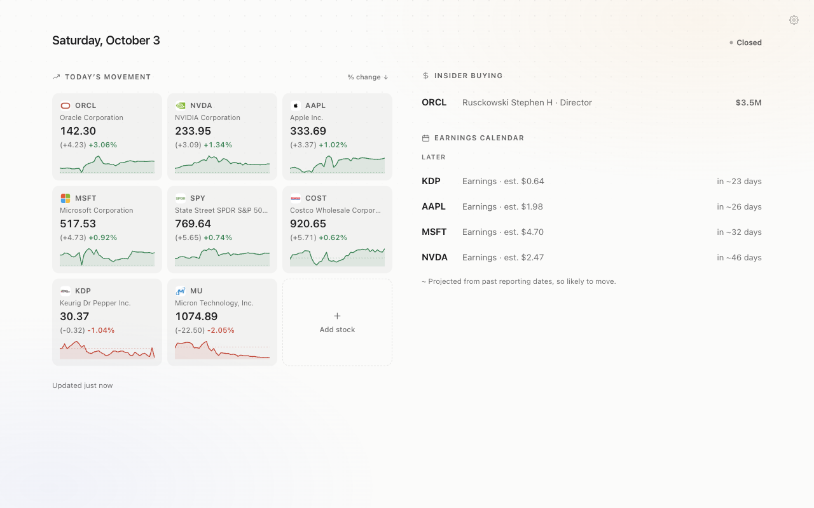

# Passive Investment Analyst

A Chrome new-tab extension for passive awareness of the stocks you follow: open a
tab and see which of them report earnings next, notable insider buying, and the
day's move — without doing anything.

- No account, no API key, no backend. Zero running cost.
- Paints from a local cache in a few milliseconds; fresh data arrives in the
  background and updates in place, with zero layout shift.
- Vanilla JavaScript and ES modules. No framework, no build step, no bundler.

<p align="center">
  
</p>

## Layout

| Path | What it is |
|---|---|
| [`catalyst/`](catalyst/) | The extension itself — exactly what gets zipped for the Chrome Web Store. [`catalyst/README.md`](catalyst/README.md) documents how it works and why. |
| [`catalyst/store/`](catalyst/store/) | Store listing copy, privacy policy, permission justifications, screenshots and promo tile. |
| [`tests/`](tests/) | Test suites, kept outside `catalyst/` so nothing ships to users. [`tests/README.md`](tests/README.md) explains each. |

## Try it locally

1. Open `chrome://extensions` and turn on **Developer mode**.
2. **Load unpacked** and choose the `catalyst/` folder.
3. Open a new tab.

After pulling changes, click **reload** on the extension: page files update on
every new tab, but the service worker only updates on reload.

## Test

```bash
node tests/run.mjs            # fast and offline: parity in 6 timezones + quotes + service worker
node tests/run.mjs --all      # + real Chrome (115/127/136), the zipped store package, live data accuracy
```

Node 22+. The real-Chrome suites need Chrome for Testing
(`npx @puppeteer/browsers install chrome@stable`). Run `--all` before every store
submission.

## Data

Market data comes from public, unauthenticated Nasdaq endpoints (with estimates
from Zacks), logos from Financial Modeling Prep and Finnhub, and optionally the
user's own Finnhub key. Third-party data can be delayed or incomplete, and nothing
here is investment advice. Not affiliated with Nasdaq, Zacks, Finnhub, Financial
Modeling Prep, or Google.
